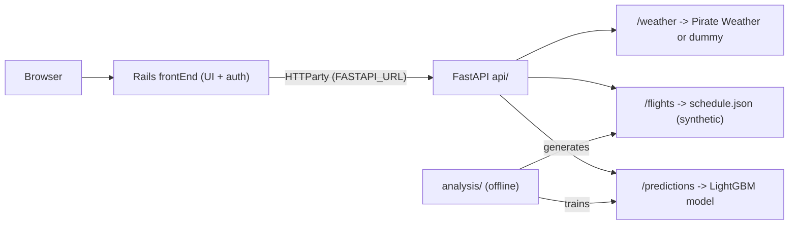

# Line of Flight

> Predict the probability that a US domestic flight will be delayed, using historical Bureau of Transportation Statistics (BTS) data, live-ish weather, and a LightGBM model.

**Status:** This project is maintained as a sample app, and was originally created as a capstone for Chicago Booth's App Development course during my MBA. It runs on **synthetic flight data** (a 72-hour schedule derived from historical BTS records and re-based to "today") and **live weather data** (real data from Pirate Weather when an API key is configured, otherwise a deterministic dummy fallback). No live commercial flight API is used due to cost contraints, but the design of the sample data was informed by actual commmercial flight APIs, and the system should be transferrable.

<!-- TODO: add a screenshot or GIF of the flight board + prediction page here -->

## What it does

- **Flight board** — a rolling 72-hour schedule of US domestic flights with at-a-glance delay risk.
- **Delay prediction** — search a route and get a calibrated delay probability, plus the top weather/operational drivers behind it.
- **Trips & watchlist** — per-user saved routes and trip history.  Over time, this could help users understand flight times and routes that put them at a greater risk of delays based on their personal travel patterns.  

## Architecture

A three-layer monorepo:

- **`frontEnd/`** — Ruby on Rails 8 app (ERB + Tailwind + a couple of React components), session auth, talks to the API over HTTP.
- **`api/`** — FastAPI service exposing weather, flights, and prediction endpoints; serves the LightGBM model.
- **`analysis/`** — offline ML pipeline: BTS data prep, weather backfill, model training, and schedule generation.



## Tech stack

- **Frontend:** Rails 8.1, Ruby 3.3, Tailwind CSS 4, React 19, Vite, HTTParty
- **Backend:** FastAPI, Uvicorn, Pydantic (Python 3.12)
- **ML:** LightGBM, pandas, scikit-learn
- **Data:** SQLite (dev), PostgreSQL (prod)
- **Deploy:** Render

## Running locally

You'll need **Ruby 3.3+**, **Python 3.12+**, and **Node 20+**. Run the two services in separate terminals.  Alternatively, visit a live version of the app hosted on Render: https://booth-appdev-lineofflight-frontend.onrender.com

Please note that we are using the free tier of Render, which causes the app to wind down after a period of inactivity. Please allow for up to 30 seconds for the app to boot up.  

### 1. Backend (FastAPI)

```bash
cd api
python -m venv .venv && source .venv/bin/activate
pip install -r requirements.txt
uvicorn main:app --reload --port 8000
```

Weather is optional: set `PIRATE_WEATHER_API_KEY` to use live weather, otherwise the API returns clearly-labeled dummy weather (`"source": "dummy"`).

### 2. Frontend (Rails)

```bash
cd frontEnd
bundle install
npm install
bin/rails db:prepare db:seed
FASTAPI_URL=http://localhost:8000 bin/dev
```

Open http://localhost:3000 and log in with the seeded demo account:

- **Username:** `daniel`
- **Password:** `fly123`

## Environment variables

See [.env.example](.env.example) for the full list. The most relevant:

- `PIRATE_WEATHER_API_KEY` — optional; unset means dummy weather.
- `FASTAPI_URL` — where Rails finds the API (default `http://localhost:8000`).

## Demo-data strategy

Because this is a public portfolio app with no paid API budget, it is designed to run fully without external dependencies:

- **Flights** are always synthetic — generated offline by `analysis/schedule_generator.py` from historical BTS CSVs into `api/schedule.json`, then date-rebased so the board always looks current.
- **Weather** uses Pirate Weather when a key is present and falls back to deterministic dummy values otherwise. The `source` field on every weather response tells you which path was used.

## License

MIT — see [LICENSE](LICENSE).